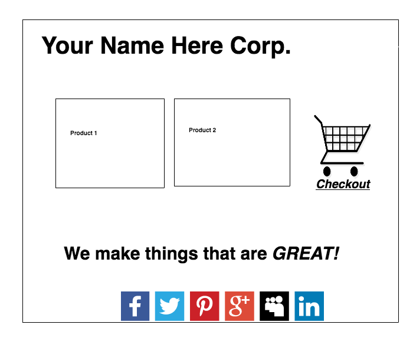

#  A/B Testing Practice

## Introduction

> ***Note:*** _This can be done as a pair programming activity or in groups of 3._

Now that we've discussed A/B testing, we're going to walk through a business case. Get ready to optimize!

You've recently started your own business, Your Name Here Corp. (aka YNHC). As head Data Scientist, your first goal is to get your sales conversion rate high enough to make some money, and gather enough data to build useful models.

In this lab, you will be expected to design and analyze an A/B test. At the end you will need to deliver a short stakeholder presentation outlining your test design, findings, and next steps. 

## Exercise

#### Requirements

- Design an A/B test to optimize conversions on YNHC.com
- Analyze the (simulated) test results to determine a winning variant
- Create a stakeholders presentation describing design, analysis, and next steps

**Bonus:**
- Perform the same analysis on [this dataset](https://github.com/generalassembly-studio/dsi-course-materials/blob/master/curriculum/04-lessons/week-08/4.2-lab/assets/datasets/CTR_Sim.csv) used in week 8 (use the weekend/week delineation as your different variants)
- Create a proposal for a Multi-Variate test on YNHC.com

Check out this amazing website design. It's breathtakingly modern, with its social media sharing and snazzy slogan. This is the site as it currently exists. It's not fancy, but it's a simple go-to-market release. For the below exercises, you'll be using this as your Control variant, from which you'll be deriving test variants.

### Part 1: Design

For this section you'll be asked to design an A/B test. The process of designing a test like this requires business decisions. Be creative- feel free to fill in the blanks, creating an identity for Your Name Here Corp. The brand identity and subsequent customer base will help decide which elements you wish to test and how you will design your test variant. This will involve the following:

1. Decide on an element you wish to change, and explain why you think it will lead to a higher conversion rate. You will be expected to create **2 variants** to test.
2. Create a chart like the one below to display the variants under test.
3. Once completed, report in to your instructor. He will provide your test results for analysis.

| Variant  | Image  | Title  |
|:-:|---|---|
| Control  | Stars  | General Assembly DSI  |
| Test 1  | Flowers  | General Assembly DSI  |
| Test 2  | Stars  | Data Science Immersive  |
| Test 3  | Flowers  | Data Science Immersive  |

* This section is mainly about making business decisions. Some elements you can expect to change would be element placement (social media links, products, cart) or content changes (more/less products, different slogan, different wording for checkout, etc.)
* The change should be testable, i.e. small enough that it is appropriate for an A/B test rather than a multi-variate test, but significant enough that it could have some affect on CR.
* Evaluate the decision based on the business reasoning as well. Why did they change what they changed?

### Part 2: Analysis

Now that you've received your group's unique set of test results, you're ready to analyse. Using the skills covered in the last lesson, as well as some techniques covered in the last few weeks ([hint](https://github.com/ga-students/DSI-SYD-1/tree/master/classes/week-08/4.2-lab)), produce a full analysis of your test results. In either an ipython notebook or an Excel spreadsheet, perform your analysis with complete documentation. This will be a part of your final deliverable.

**Bonus:** If you have time, go back and perform the same analysis on [this dataset](https://github.com/ga-students/DSI-SYD-1/tree/master/classes/week-08/4.2-lab/assets/datasets/CTR_Sim.csv) from Week 8. You may treat the `weekend` dummy variable as your variant split. 

### Part 3: Presentation

Put together a 5 minute presentation displaying your test design, the results, and analysis. You should have plenty of practice with this by now!

The first part of your stakeholder's presentation will cover the design decisions made. Include any descriptions of the decisions made while designing the test.
This section should answer questions such as:

The second portion of your presentation should cover the results of your analysis. You should explain which tests you used, what they told you, and what you believe the best next steps are for YNHC.com.
- Which variant won?
- Based on the analysis done, what is your level of confidence in the results?
- How can these results inform business decisions?

The final portion of your presentation should include a proposal for a future test. This one will be a *Multi-Variate* test. Include test design, description of potential benefits, and discussion about challenges in analysing the test's results.

At the end of class, we'll have groups present their test results to the class, with you fellow students role playing as your stakeholders. 

#### Deliverable

In a github PR, please submit:
- Mockups of your designs
- Documentation of your analysis process
- Stakeholder's presentation
- A proposed Multi-Variate test design for YNHC.com

**Bonus:**
- Analysis of Week 8 dataset

## Additional Resources

- [Designing A/B Tests](http://www.win-vector.com/blog/2015/06/designing-ab-tests/)
- [A/B Testing Statistics](http://insightdatascience.com/blog/ab_testing_statistics.html)
