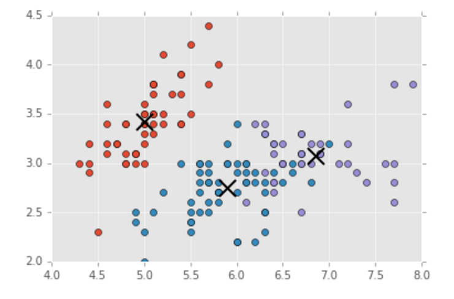
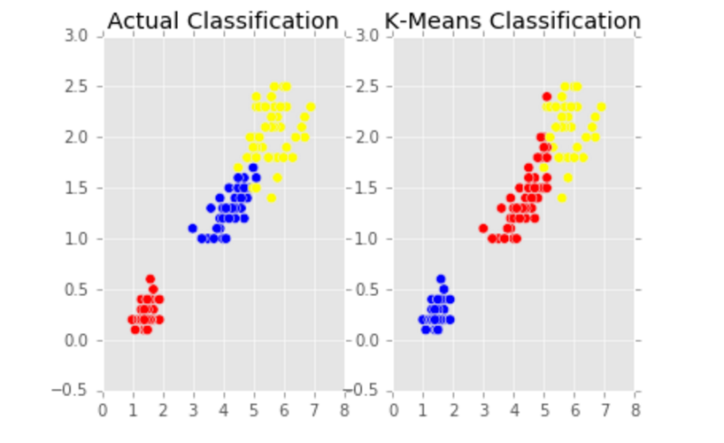
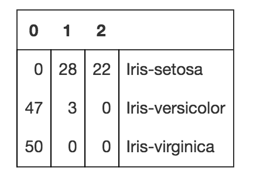

#  Tuning Clusters
Week 7 | Lesson 1.3

### LEARNING OBJECTIVES
*After this lesson, you will be able to:*
- Understand the composition of a cluster
- Evaluate the results of a K-Means Clustering Analysis


### STUDENT PRE-WORK
*Before this lesson, you should already be able to:*
- Write functions in Python
- Have a working knowledge of Pandas and Scikit-Learn


### LESSON GUIDE
| TIMING  | TYPE  | TOPIC  |
|:-:|---|---|
| 5 min  | [Opening](#opening)  | Opening  |
| 10 min  | [Introduction](#introduction)   | So I performed a clustering analysis - Now what  |
| 15 min  | [Demo](#demo)  | Techniques to Evaluate Clusters  |
| 25 min  | [Guided Practice](#guided-practice<a name="opening"></a>)  | Practice Cluster Evaluation Techniques |
| 25 min  | [Independent Practice](#ind-practice)  | Perform a k-means cluster analysis and evaluate the results |
| 5 min  | [Conclusion](#conclusion)  | Conclusion  |

---

<a name="opening"></a>
## Opening (5 mins)

**Check:** Recall the techniques of k-means clustering and recall the process from start to finish. 

<a name="introduction"></a>
## Introduction: Intro  (5 mins)

#### So I performed a clustering analysis - Now what? 

Remember that before we conduct our k-means analysis, we needed to decide how to select "k". In the previous lesson, we visually selected "k", we can lead to noise in our analysis. Today, we're going to learn about how to evaluate this analysis. 

Now that you know how to perform a k-means clustering analysis, how do we know if we have good results? 

The key to understanding your clustering analysis are the visual evaluation of your clusters, the measurement of their characteristics, and the computation of metrics that can measure how good your analysis is and how to interpret it. In the following sections, we'll look at a few common methods for understanding and validating your analysis.

So what constitutes a good cluster versus a bad cluster? Largely based on the accuracy and precision of the analysis, we can explore how well we've characterized our data.

**Check:** How might we think about "Good" clusters vs "Bad" clusters ? 

<a name="demo"></a>
## Techniques to Evaluate Clusters - Demo (15 mins)

From visual methods to metrics to algorithms, there are many methods that we can use to evaluate clusters and our clustering algorithms. Today, we're going to look at a few of the more common ones. 

#### Visualization

When evaluating clusters, the first and easiest method is to visually examine the output of the clustering algorithm. After we run the algorithm and calculate the centroids as we did in the previous lesson, we can plot the resulting clusters to see where the centroids are based and how the clusters are grouping. 




We can also compare the classification of the original data to the classification given by our analysis - this gives us a first, primary look at how our analysis is performing in comparison to the original classifications.




#### Silhouette Scores

The silhouette score, or silhouette coefficient, is the measure of how closely related a point is to members of its cluster rather than members of other clusters. If the resulting score is high, then the clustering analysis has an appropriate number of clusters. If the score is low, there are either too many or too few clusters.

```python
metrics.silhouette_score(X, predicted, metric='euclidean')
```

In this Python example, we measure the distance between points using Euclidean distance, the typical direct distance between two points. The metric can also be computed using Manhattan Distance, however we will stick to using Euclidean.

Since the silhouette score is based on the clustered data itself, we call it an **internal evaluation**.

#### F - Measure

The F Measure, sometimes known as the [F1 Score](http://scikit-learn.org/stable/modules/generated/sklearn.metrics.f1_score.html#sklearn.metrics.f1_score), is used to measure the test's accuracy by measuring the number of correct positive results versus the positive results that should have been returned. It is the weighted average of the **precision** and **recall** - where precision is the amount of items that were relevant to our analysis, and recall being the number of relevant items that were successfully retrieved. In Python, we can calculate each of these measures with one line of code:

```python
metrics.classification_report(y_test, predicted)
```

Since the F - Measure is based on data that was not used for clustering, we call is an **external evaluation**.

#### Confusion Matrix

Despite the name, a confusion matrix is anything but confusing. It's a simple quadrant graph with metrics that looks like this:



When used in clustering, the matrix has the predicted class labels on the top x axis, and the actual class labels on the y axis. Each number within the matrix represents how many of the true classes were classified as each of the predicted classes. 

Where the name "confusion" comes in: a non-confused class will have large values on the diagonal, so that the predicted classes match up with the actual classes, whereas a "confused" class will have values all over the place.

If we look back at our comparison graph above, we can see this in action - the predicted classes do not match up well with the actual classes, so we have "confused" classes!

To implement it in Python, we only need one line of code from Scikit-Learn: 

```python
metrics.confusion_matrix(y_test, predicted)
```

The confusion matrix is a form of **external evaluation**. 


<a name="ind-practice"></a>
## Independent Practice: Perform a K-Means Analysis and Evaluate the Clusters (20 minutes)

Now that we've walked through the process of clustering and measuring your clusters, it's time to put your skills to the test. We're going to be looking at the [classic Iris dataset](./assets/datasets/iris.csv) to understand how the measurements cluster and how to evaluate our analysis. 

Open the [starter code](./code/starter-code/starter-code.ipynb) and try to work through both exercises with a partner. Do your best!


<a name="conclusion"></a>
## Conclusion (5 mins)
- There are numerous methods for evaluating your clustering analysis, including visualizations, silhouette scores, F-metrics, and confusion matrices
- After analyzing clusters, you may have to go back and tune the value of "k" in your analysis
- Always examine multiple metrics to understand how our analysis performed

***

## Additional Resources

- [K Means & Clustering](https://dl.dropboxusercontent.com/u/6044937/PyData/SKL31-KMeans.pdf)
- [Additional description & videos from Udemy](https://www.udemy.com/cluster-analysis-unsupervised-machine-learning-python/)

